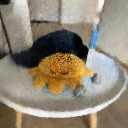
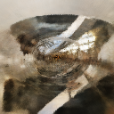

# NeRF Project

The purpose of this project is to familiarize with and gain some practical experience with NeRFs.

I also think I did a really good job with code visibility, comments and modularization, so that everything is kept minimal. If someone is just getting started with NeRFs, it should be pretty easy to follow.

# Datasets

A network has been trained for the following 3 scenes:
- The "trex" real scene from the original NeRF paper dataset
- The "ship" synthetic scene from the original NeRF paper dataset
- A custom scene from 3 objects on a table with photos that I took using my phone.

# Structure From Motion

To get an initial sparse pointcloud, as well as the camera poses of the scene, we must first run SFM.

To run SFM on the collected images using the COLMAP library, run:
```
python scripts/imgs2poses.py path/to/dataset
```

Remember that `path\to\dataset` needs to point to a directory where there is an "images" folder inside, containing all the .jpg images that you want to train your NeRF on.

# Train NeRF

To train the NeRF model run:
```
python main.py
```
but make sure to change the `dataset_path` in the `main.py` file.

# Synethetic data

The synthetic data from the original NeRF paper do not come with a `poses_bounds.npy` file. Instead, they offer a `transforms_train.json` file. You can use the `json2npy.py` script in scripts to convert the json file to an npy file so that you don't have to modify the dataloaders.
```
python scripts/json2npy.py
```
but make sure to change the `dataset_path` in the `main.py` file.

# Results

All the models were trained with images of size 128*128 and a batch size of 2048 rays.
More configuration parameters can be found in the `main.py` file.
All the trainings were stop prematurely because training the NeRF was too time-consuming and I needed my laptop to do other stuff.

## Custom

Custom scene after 32000 iterations.

<table>
  <tr>
    <td style="text-align: center;">
      
      <br>
      <strong>Rendered Image</strong>
    </td>
    <td style="text-align: center;">
      
      <br>
      <strong>Target Image</strong>
    </td>
  </tr>
</table>

<table>
  <tr>
    <td></td>
    <td></td>
  </tr>
</table>


## Trex

Trex (from original NeRF dataset) after approximately 50000 iterations.

<table>
  <tr>
    <td style="text-align: center;">
      
      <br>
      <strong>Rendered Image</strong>
    </td>
    <td style="text-align: center;">
      
      <br>
      <strong>Target Image</strong>
    </td>
  </tr>
</table>

## Ship

Synthetic ship (from original NeRF dataset) 5000 iterations.

<table>
  <tr>
    <td style="text-align: center;">
      
      <br>
      <strong>Rendered Image</strong>
    </td>
    <td style="text-align: center;">
      
      <br>
      <strong>Target Image</strong>
    </td>
  </tr>
</table>

# Comments

In the "feat/hierarchical_sampling" branch, you can find the coarse-fine hierarchical/importance sampling version of the original NeRF, where we use a coarse NeRF, with lower embedding dimension, to do importance sampling for the fine network, which has a higher embedding dimension. However, there is a bug somewhere in the code, which I failed to detect, causing a weird "stripe" effect in the rendered scene. You can see it in the picture below:

<table>
  <tr>
    <td style="text-align: center;">
      
      <br>
      <strong>Coarse Output</strong>
    </td>
    <td style="text-align: center;">
      
      <br>
      <strong>Target Image</strong>
    </td>
    <td style="text-align: center;">
      
      <br>
      <strong>Fine Output</strong>
    </td>
  </tr>
</table>

Feel free to open a PR if you manage to solve it.
